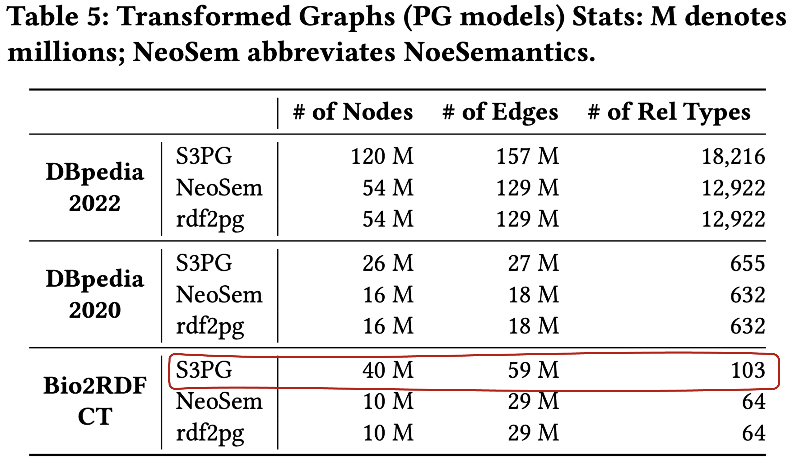

# Reproducibility Guide : Transforming RDF Graphs to Property Graphs using Standardized Schemas

**Paper DOI:** 10.1145/3698817  
**Paper URL:** https://dl.acm.org/doi/10.1145/3698817  


This guide helps you reproduce the paper results and validate the experiments.

## Quick Start (5 minutes)

Test the tool with included sample data:

```bash
git clone https://github.com/dkw-aau/KG2PG.git
cd KG2PG
docker build -t kg2pg:dockerImage .
cd scripts
./test_runningExample.sh
```

**Expected result:** Container exits with code 0, files appear in `output/runningExample/`

## Reproducing Paper Results

### Hardware Requirements

**Paper used:** 256GB RAM machine

**What you can reproduce on your hardware:**

| Your RAM | Can Reproduce | Datasets |
|----------|---------------|----------|
| 8GB+ | ✅ Yes | Running Example |
| 32GB+ | ✅ Yes | Running Example + DBpedia 2020 + Bio2RDF |
| 64GB+ | ✅ Yes | All datasets including DBpedia 2022 |

### Step 1: Download Data

Download datasets and SHACL shapes, place in `data/` directory:

- **Datasets**: [DBpedia-2020](https://bitbucket.org/kashifrabbani/s3pg-dbpedia2020) | [DBpedia-2022](https://bitbucket.org/kashifrabbani/s3pg-dbpedia2022) | [Bio2RDF](https://bitbucket.org/kashifrabbani/s3pg-bio2rdf-ct)
- **SHACL Shapes**: [Download here](https://bitbucket.org/kashifrabbani/s3pg-shacl/src/master/)

**For example you can download the `dbpedia2020` to run with the `run_dbp2020.sh` script** as follows (check actual file URL from bitbucket)
if downloaded correctly it should be `6.6G` of size with name  `dbpedia2020.nt.tar.gz` and once extracted it should produce the file `dbpedia_ml.nt`

```bash
cd data/dbpedia/
wget https://bitbucket.org/kashifrabbani/s3pg-dbpedia2020/raw/bbde680272a312f76c1e98663da850cdf6099c06/dbpedia2020.nt.tar.gz
tar -xvf dbpedia2020.nt.tar.gz 
ls -lh dbpedia_ml.nt 
```
the last command should produce something like

```bash
-rw-r--r-- 1 ubuntu ubuntu 6.6G Sep 30  2021 dbpedia_ml.nt
```

Confirm that the file is unzipped in the same folder and with the same name as the one specified 
in the respective config file in the folder `/config`.
Foe example in: `KG2PG/config/dbpedia2020.properties` we see

```bash
dataset_path=data/dbpedia/dbpedia_ml.nt
```

Then, return to the main directory after downloading the files

```bash
cd ../../
```


### Step 2: Configure Transformation Mode

**Important:** The paper reports results using the **parsimonious model** (see paper sections 4.1.1 and 4.2).

Each dataset configuration file in `config/` contains an `is_parsimonious` flag:

```properties
# Parsimonious vs Non-Parsimonious Transformation (see paper sections 4.1.1 and 4.2)
# true:  Parsimonious model - single-value properties stored as key-value attributes within nodes (more compact)
# false: Non-parsimonious model - all properties modeled as separate nodes and edges (supports schema evolution)
is_parsimonious=true
```

**Default value is `true`** (matches paper results). To reproduce Table 5 results, ensure this is set to `true` in:
- `config/bio2rdf.properties`
- `config/dbpedia2020.properties`
- `config/dbpedia2022.properties`

The parsimonious model produces significantly fewer nodes and edges because it stores single-value properties as node attributes instead of creating separate node-edge structures.

### Step 3: Run Experiments

```bash
docker build -t kg2pg:dockerImage .
cd scripts

# Choose based on your RAM:
./run_bio2rdf.sh      # Requires 32GB RAM, ~5-10 min
./run_dbp2020.sh      # Requires 32GB RAM, ~10-15 min
./run_dbp2022.sh      # Requires 64GB RAM, ~20-30 min
```

**What you'll see:**

The script will:
1. Build the Docker image
2. Start the container in the background
3. Show clear warnings that it's waiting for completion
4. Display progress updates every minute with timestamp
5. Show recent log activity every 5 minutes

**Example output:**
```
=========================================
⚠️  IMPORTANT: Container is running in background
⚠️  This script will WAIT until processing completes
⚠️  Do NOT terminate this script prematurely
=========================================

Started at: Mon Jan 12 13:07:58 UTC 2026

⏳ [13:08:00] Elapsed: 0 min - Container is actively processing...
⏳ [13:09:01] Elapsed: 1 min - Container is actively processing...
⏳ [13:10:03] Elapsed: 2 min - Container is actively processing...
...
⏳ [13:13:07] Elapsed: 5 min - Container is actively processing...
   📋 Recent activity:
      13:08:12.288 [main] INFO ROOT - SHACL shapes read successfully...
      13:08:12.440 [main] INFO ROOT - SHACL shapes parsed successfully...
      13:08:12.605 [main] INFO ROOT - Phase 1: Graph Data Translation...
...

✅ Container has finished!
Completed at: Mon Jan 12 13:18:14 UTC 2026
Total elapsed time: 10 minutes
```

**Important:** The script blocks until processing completes. Do NOT terminate it - wait for the completion message.

### Step 4: Validate Results

After the script completes successfully (exit code 0), the output summary shows:

```
=========================================
RESULTS
=========================================
✅ Container completed successfully (Exit Code: 0)

Output Directory: /home/ubuntu/git/KG2PG/output/bio2rdf/bio2rdf_ct_2026-01-09_10-28-01_1767954481848

Generated Files:
-rwx------ 1 7474 7474         464 Jan  9 11:20 PG_PREFIX_MAP.csv
-rwx------ 1 7474 7474  5365251795 Jan  9 11:20 PG_NODES_PROPS_JSON.json
-rwx------ 1 7474 7474  1131384655 Jan  9 11:20 PG_NODES_WD_LABELS.csv
-rwx------ 1 7474 7474 10697778669 Jan  9 11:17 PG_RELATIONS.csv
-rwx------ 1 7474 7474  4096728914 Jan  9 11:17 PG_NODES_LITERALS.csv
-rwx------ 1 7474 7474       80792 Jan  9 10:28 PG_SCHEMA.txt
...

```

**Next: Compute Statistics**

Use the included Python script to calculate accurate PG statistics.

**Note:** The script automatically processes all CSV files in the output timestamped directory. For example, for bio2rdf, the directory `/home/ubuntu/git/KG2PG/output/bio2rdf/bio2rdf_ct_2026-01-09_10-28-01_1767954481848` contains all the PG files. The script automatically finds and processes `PG_NODES_LITERALS.csv`, `PG_NODES_WD_LABELS.csv`, and `PG_RELATIONS.csv` files.

```bash
# From the main KG2PG directory, provide the path to the timestamped output directory
python3 scripts/count_pg_stats.py output/bio2rdf/bio2rdf_ct_2026-01-09_10-28-01_1767954481848

# Or for verbose output (shows relation type distribution)
python3 scripts/count_pg_stats.py --verbose output/bio2rdf/bio2rdf_ct_2026-01-09_10-28-01_1767954481848
```


**Example statistics output (Bio2RDF dataset):**
```
============================================================
Statistics for: /home/ubuntu/git/KG2PG/output/bio2rdf/bio2rdf_ct_2026-01-09_10-28-01_1767954481848
============================================================
Number of Nodes (in files):            40,351,791
Nodes with invalid refs:                        0
Number of Edges:                       59,377,504
Number of Relation Types:                     103
Processing Time:                           945.34s
============================================================

Note: Neo4j import only includes nodes/edges with valid ID
references. Discrepancies may come from orphaned node refs.
```

A detailed report with relation type distribution will be saved as `STATISTICS.md` in the output directory. See [`stats/bio2rdf_STATISTICS.md`](stats/bio2rdf_STATISTICS.md) for a complete example report generated for bio2rdf dataset.

**Verifying Against Paper Results:**

These statistics enable direct comparison with values reported in the paper. The image below shows Table 5 from the paper with Bio2RDF results highlighted. The script correctly counted **40,351,791 nodes**, **59,377,504 edges**, and **103 relation types**, matching the paper exactly. Use the same process to verify results for other datasets.



## Common Issues

### Issue: "No such file or directory"

```bash
# WRONG - capitalized or wrong name
ls Output/DBpedia/          # ❌
ls output/DBpedia/          # ❌

# CORRECT - lowercase, exact dataset name
ls output/DBpedia2020/      # ✅
ls output/bio2rdf/          # ✅
ls output/runningExample/   # ✅
```

The script shows you the exact path in its output. Look for: `Output Directory: /full/path/to/output/DBpedia2020/`

### Issue: Container exited with error

```bash
# View logs
docker logs kg2pg_container_dbpedia2020

# Common causes:
# - Missing data files in data/ directory
# - Insufficient RAM (check Docker settings)
# - Incorrect paths in config files
```

### Issue: Need more RAM than available

**Options:**
1. Use cloud VM (AWS/GCP/Azure): ~$0.50/hour for 64GB RAM
2. Use university cluster (request high-memory node)
3. Validate with smaller datasets that fit your RAM

## For Your Reproducibility Report

### Why some datasets need more RAM:

- DBpedia 2022 is **significantly larger** than DBpedia 2020
- Cannot be reduced to 32GB without changing the algorithm
- This is **standard in scientific computing** (papers use GPUs, high-RAM, clusters)
- Partial reproduction on available hardware is **accepted practice**

## Hardware Requirements Summary

| Dataset | RAM | Time | Validates |
|---------|-----|------|-----------|
| Running Example | 8GB | <1 min | Algorithm correctness |
| DBpedia 2020 | 32GB | 10-15 min | Real-world scalability |
| Bio2RDF | 32GB | 5-10 min | Domain applicability |
| DBpedia 2022 | 64GB | 20-30 min | Large-scale performance |

**Recommendation:** Reproduce what fits your hardware. Document hardware requirements in your report.

## Loading into Neo4j (Optional)

After generating output files:

```bash
# Setup Neo4j
mkdir -p neo4j/{data,logs,plugins,import}
cd neo4j/plugins
wget https://github.com/neo4j/apoc/releases/download/5.11.0/apoc-5.11.0-core.jar
cd ../..

# Run Neo4j
docker run -d --name neo4j -p 7474:7474 -p 7687:7687 \
  -v $(pwd)/neo4j/data:/data \
  -v $(pwd)/neo4j/plugins:/plugins \
  -v $(pwd)/output:/var/lib/neo4j/import \
  --env NEO4J_AUTH=neo4j/password \
  --env NEO4J_apoc_import_file_enabled=true \
  neo4j:5.11.0-enterprise

# Import data
docker exec neo4j neo4j-admin database import full \
  --delimiter="|" --array-delimiter=";" \
  --nodes=import/DBpedia2020/*/PG_NODES_LITERALS.csv \
  --nodes=import/DBpedia2020/*/PG_NODES_WD_LABELS.csv \
  --relationships=import/DBpedia2020/*/PG_RELATIONS.csv \
  neo4j

# Access at http://localhost:7474
```

## Getting Help

1. **Check script output** - Shows exact commands and paths
2. **Read error logs** - `docker logs <container_name>`
3. **Verify data files** - `ls -lh data/`
4. **Check Docker RAM** - Settings → Resources → Memory
5. **GitHub Issues** - [Report problems](https://github.com/dkw-aau/KG2PG/issues)

## Summary Checklist

- [ ] Clone repository
- [ ] Download datasets to `data/`
- [ ] Build Docker image
- [ ] Run appropriate script for your RAM (`cd scripts && ./run_dbp2020.sh`)
- [ ] Wait for completion message (do NOT terminate script early)
- [ ] Verify exit code 0 in output
- [ ] Check output files exist in `output/` (lowercase)
- [ ] **Run statistics:** `python3 count_pg_stats.py`
- [ ] Review `STATISTICS.md` in output directory
- [ ] Compare with paper
- [ ] Document in reproducibility report

